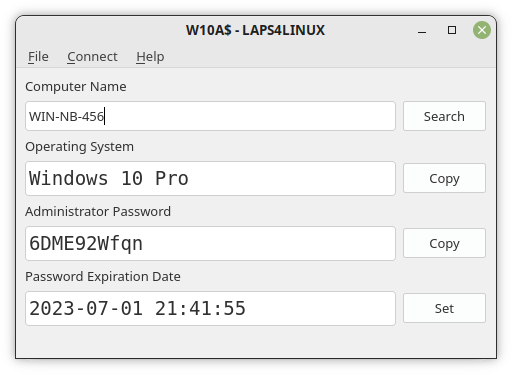

# LAPS4LINUX
Linux implementation of the Local Administrator Password Solution (LAPS) from Microsoft.

## Management Client
### Command Line Interface (CLI)
```
$ ./laps-cli.py notebook01 --set-expiry "2021-04-28 01:01:01"
LAPS4LINUX CLI v1.0.0
https://github.com/schorschii/laps4linux

🔑 Password for »ldapuser«:
Connection:     ldapserver01: user@example.com
Found:          CN=NOTEBOOK01,OU=NOTEBOOKS,DC=example,DC=com
Password:       abc123
Expiration:     132641316610000000 (2021-04-29 01:01:01)
New Expiration: 132640452610000000 (2021-04-28 01:01:01)
Expiration Date Changed Successfully.


$ ./laps-cli.py "*"
LAPS4LINUX CLI v1.0.0
https://github.com/schorschii/laps4linux

🔑 Password for »ldapuser«:
Connection: ldapserver01: user@example.com
NOTEBOOK01$ : abc123
NOTEBOOK02$ : 123abc
...
```

### Graphical User Interface (GUI)


### Kerberos Authentication
The client (both GUI and CLI) supports Kerberos authentication which means that you can use the client without entering a password if you are logged in with a domain account and have a valid Kerberos ticket. If not, ldap3's "simple" authentication is used as fallback and the client will ask you for username and password.

### SSL Connection
It is highly recommended to turn on SSL in the config file (`~/.laps-client.json`) if your LDAP server has a valid certificate (set `ssl` to `true` and `port` to `636`). You can also configure multiple LDAP server in the config file.

### Domain Forest Searches
If you are managing multiple domains, you probably want to search for a computer in all domains. Please use the global catalog for this. This means that you need to set the option `gc-port` in the configuration file of all servers, e.g. to `3268` (LDAP) or `3269` (LDAPS).

Example:
```
{
    "server": [
        {
            "address": "dc.example.com",
            "port": 636,
            "gc-port": 3269,
            "ssl": true
        },
        .....
    ],
    .....
}
```

Since the global catalog is read only, LAPS4LINUX will switch to "normal" LDAP(S) port when you want to change the password expiry date. That's why, the `port` option is still required even if a `gc-port` is given!

### Query Additional Attributes
LAPS4LINUX allows you to query additional attributes besides the admin password which might be of interest for you. For that, just edit the config file `~/.laps-client.json` and enter the additional LDAP attributes you'd like to query into the settings array `"ldap-attributes"`.

### Default Config File
You can create a preset config file `/etc/laps-client.json` which will be loaded if `~/.laps-client.json` does not exist. With this, you can distribute default settings (all relevant LDAP attributes, SSL on etc.) for new users.

### `laps://` Protocol Scheme
The GUI supports the protocol scheme `laps://`, which means you can call the GUI like `laps-gui.py laps://HOSTNAME` to automatically search `HOSTNAME` after startup. This feature is mainly intended to use with the [OCO server](https://github.com/schorschii/OCO-Server) web frontend ("[COMPUTER_COMMANDS](https://github.com/schorschii/OCO-Server/blob/master/docs/Computers.md#client-commands)").

### Windows and macOS
The GUI is also executable under Windows and macOS. It's ported to Windows because of the additional features that the original LAPS GUI did not have (query custom attributes, OCO integration).

## Runner
The runner is responsible for automatically changing the admin password of a Linux client and updating it in the LDAP directory. This assumes that Kerberos (`krb5-user`) is installed and that the machine is already joined to your domain using Samba's `net ads join`, PBIS' `domainjoin-cli join` or the modern `adcli join` command (recommended).

A detailed domain join guide is available [on my website](https://georg-sieber.de/?page=blog-linux-im-unternehmen) (attention: only in German).

The runner should be called periodically via cron. It decides by the expiration time stored in the LDAP directory when the password should be changed.
```
*** /etc/cron.hourly/laps-runner ***

#!/bin/sh
/usr/sbin/laps-runner --config /etc/laps-runner.json
```

Please configure the runner by editing the configuration file `/etc/laps-runner.json`. You can leave the server array empty if the runner should auto-discover your domain controllers by DNS SRV records.

You can call the runner with the `-f` parameter to force updating the password directly after installation. You should do this to check if the runner is working properly.

### Hostnames Longer Than 15 Characters
Computer objects in the Microsoft Active Directory can not be longer than 15 characters. If you join a computer with a longer hostname, it will be registered with a different "short name". You have to enter this short name in the config file (setting `hostname`) in order to make the Kerberos authentication work. You can find out the short name by inspecting your keytab: `sudo klist -k /etc/krb5.keytab`.

Set the `hostname` option to `null` (default) to use the system's normal host name.

### Troubleshooting
If the script throws an error like `kinit -k -c /tmp/laps.temp SERVER$ returned non-zero exit code 1`, please check what happens when you execute the following commands manually on the command line.
```
sudo kinit -k -c /tmp/laps.temp COMPUTERNAME$
sudo klist -c /tmp/laps.temp
```
Please replace COMPUTERNAME with your hostname, but do not forget the trailing dollar sign.

## Support
If you like LAPS4LINUX please consider making a donation using the sponsor button on [GitHub](https://github.com/schorschii/LAPS4LINUX) to support further development.

You can hire me for commercial support or adjustments for this project. Please [contact me](https://georg-sieber.de/?page=impressum) if you are interested.
